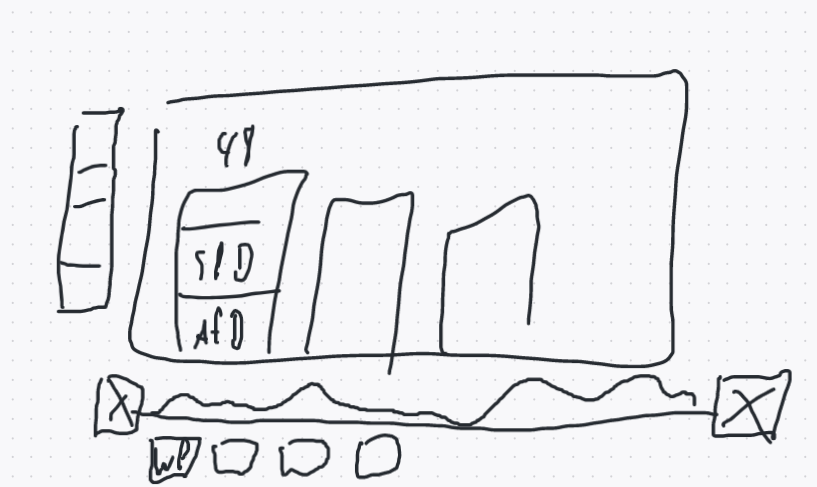
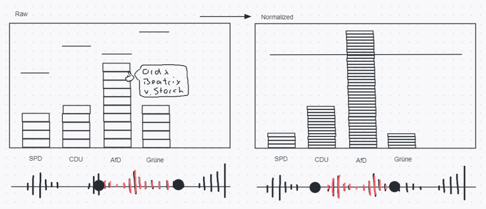
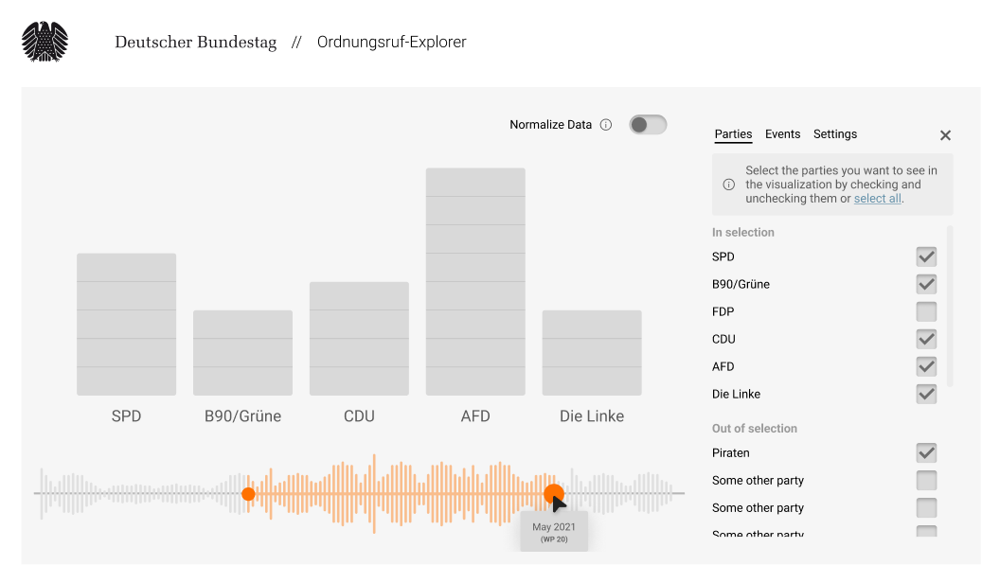

# Ordnungsruf Explorer - Im Modul Visualisierung

## Basic Info

<!-- The project title, your names, e-mail addresses, student
number, a link to the project URL (this link should provide all
files of your project). -->

| Name           | E-Mail                     | Matrikelnummer   |
|----------------|----------------------------|------------------|
| Yannic Brügger | yannic.bruegger@smail.th-koeln.de  | 11125713 |
| Jan Koll       | jan.koll@smail.th-koeln.de         | 11125790 |
| Sven Linßen    | sven.linssen@th-koeln.de           | 11089166 |
| Tim Loges      |                                    |          |

**Projekt Link** https://github.com/WasMachenSachen/vi-project

## Background and Motivation

<!-- Discuss your motivations and reasons for choosing this project,
especially any background or research interests that may have
influenced your decision. -->

Der Ordnungsruf Explorer ist als Idee aufgekommen, als die letzte Wahl des Deutschen Bundestages erst wenige Wochen in der Vergangenheit lag. Zur gleichen Zeit ist ein YouTube Format, *Best of Bundestag*, populär geworden. In diesem Format werden vermeidlich lustige oder obskure Szenen aus dem Bundestag zusammengeschnitten. Unter anderem gibt es eine Reihe, die speziell Ordnungsrufe zeigt. Ordnungsrufe werden Abgeordneten durch den/die Bundespräsident:in erteilt, wenn diese sich nicht korrekt verhalten, z.B. durch das Äußern einer unangemessenen Aussage.

Uns als Projekt-Team hat sich dabei die Frage gestellt, ob im Vergleich zu vergangenen Legislaturperioden gleich viele, mehr oder weniger Rufe erteilt werden und ob die Parteien im Schnitt unterschiedlich viele erhalten. Es gibt vom Bundestag zwei Veröffentlichungen ([WP01-11](https://www.bundestag.de/resource/blob/273012/c5607fa52b61d592861c017ce0e70c55/Kapitel_23_Statistische_Gesamt__bersicht_1______11__Wahlperiode-pdf-data.pdf) [WP12-19](https://www.bundestag.de/resource/blob/196296/4b2ee134475f75e677cdf679caff93a8/Kapitel_07_16_Ordnungsma__nahmen-data.pdf)), aus denen man zwar die Anzahl der Rufe pro Legislaturperiode entnehmen kann, aber nicht die Verteilung auf Parteien oder spezifischere Zeitabschnitte.

Um einen besseren Überblick der Verteilung der Ordnungsrufe zu bekommen, ist die Idee entstanden, diese mittels einer interaktiven Visualisierung abzubilden. Dadurch könnten möglicherweise Erkenntnisse darüber getroffen werden, wie das Verhältnis von Parteisitzen und Rufen zueinander steht. Oder welche Parteien besonders "laut" sind.

## Related Work

<!-- Anything that inspired you, such as a paper, a web site,
visualisations we discussed in class, etc. -->

Für den Deutschen Bundestag ist uns keine Anwendung mit ähnlicher Funktion bekannt. Neben den bereits erwähnten Veröffentlichen des Bundestags über die Ordnungsrufe pro Wahlperiode ([WP01-11](https://www.bundestag.de/resource/blob/273012/c5607fa52b61d592861c017ce0e70c55/Kapitel_23_Statistische_Gesamt__bersicht_1______11__Wahlperiode-pdf-data.pdf) [WP12-19](https://www.bundestag.de/resource/blob/196296/4b2ee134475f75e677cdf679caff93a8/Kapitel_07_16_Ordnungsma__nahmen-data.pdf)), bietet der Bundestag eine [API Schnittstelle](https://dip.bundestag.de/über-dip/hilfe/api) an. Mittels dieser API lassen sich zwar auch Ordnung rufe Filtern, diese sind allerdings unvollständig (kleiner 30 Treffer).

## Project Objectives and Goals

<!-- Provide the primary questions you are trying to answer with your visualisation.
What would you like to learn and accomplish? List the benefits. -->

Erstellen einer interaktiven Visualisierung der Ordnungsrufe im deutschen Bundestag. Diese werden nach Zeit, Parteien und Inhalt angezeigt.

## Funktionalität

<!-- Describe in detail which data manipulations (sort, filter,..) and visual
manipulations (zoom, selection,...) you would want to implement and how these
support the goals. -->

## Data

<!-- From where and how are you collecting your data? If appropriate, provide a link
to your data sources. -->

Die verwendeten Daten stammen aus der vom Bundestag bereitgestellten [API](https://dip.bundestag.de/über-dip/hilfe/api), für die wir auf Anfrage einen Zugang erhalten haben. Wie erwähnt gibt es eine Möglichkeit nach Ordnunsgrufen zu filtern, dabei wird allerdings nur ein Bruchteil dieser ausgegeben. 

Um alle Rufe zu erfassen, wurden mittels eines eigenen Programms alle Transkripte durchlaufen und nach passenden Textpassagen gesucht. Da diese nicht immer eindeutig als Ordnungsruf an eine bestimmte Person identifizierbar sind, musste zusätzlich eine Liste aller jemals im Bundestag vertretenen Abgeordneten aus der API exportiert werden, um diesen Rufe zuzuordnen. 

> Bei diesem Verfahren kommt es mit hoher Wahrscheinlichkeiten zu Ungenauigkeiten, die nur mittels manueller Überprüfung behoben werden könnten. Aufgrund der großen Datenmenge (879 Treffer) wurde sich bewusst dazu entschieden dies für den MVP zu vernachlässigen und somit eine (hoffentlich) minimale Ungenauigkeit in Kauf zu nehmen. Eine präzisere Alternative hätte ein Textmining-Algorithmus bieten können, dessen Implementierung jedoch im Rahmen des Projektes als zu aufwendig eingeschätzt wurde.

## Data Processing

<!-- Do you expect to do substantial data cleanup? What quantities do you plan to
derive from your data? How would data processing be implemented? -->

Um die Textpassagen mit den Abgeordneten zu mappen, wurde mit einem Python Script nach dem Nachnamen der jeweiligen Abgeordneten die zum Zeitpunkt der Erstellung der Textpassage im Bundestag saßen gesucht. Falls ein Name in einer Textpassage vorhanden war, wurde die jeweilige Person als zur Ordnung gerufend eingetragen. Übrige Zeilen mit leeren Textpassagen wurden gelöscht.

Zudem wurde in weiten Teilen mit Openrefine gearbeitet um den Datensatz zu strukturieren. Präsidenten wurden nach dem Datum der Erstellung der Textpassagen nachträglich eingetragen (Quelle: https://www.bundestag.de/parlament/geschichte/bundestagspraesidenten_seit_1949). Die Parteiangehörigkeit der zur Ordnung gerufenden war zu dem im selben Textfeld und wurde herausextrahiert in eine neue Spalte. Datumseinträge ließen sich zudem mit Openrefine normen.

Die entstandene Excel-Datei wurde daraufhin mit einem weiteren Python-Skript in ein zuvor vereinbartes JSON-Format gebracht.

## Visualisation Design

<!-- How will you display your data? Provide some general ideas that you
have for the visualisation design. Develop three alternative prototype
designs for your visualisation. Create one final design that
incorporates the best of your three designs. Describe your designs
and justify your choices of visual encodings. We recommend you use
the Five Design Sheet Methodology (fds.design) -->

Die Grundidee ohne Visualisierung entstand in einem Brain Storming Meeting der Projektmitglieder. In einer ersten Iteration wurde diese Idee von allen durch einfache Sketches visualisiert, um ein gemeinsames verständnis des Zielbilds zu erhalten. Folgende Abbildung zeigt ein Beispiel der ersten Visualisierungsversuche. Es sind bereits die zentralen Komponenten (Stacked Bars; Timeline mit Range) zu erkennen. 

In einem zweiten Meeting wurden die besten Ideen und Aspekte identifiziert und herausgearbeitet. Ebenso wurden über weitere Funktionalitäten diskutiert, wie die Erweiterung um einen Zweiten Datensatz wodurch neue Erkenntnisse gewonnen werden könnten. Ein Beispiel dafür ist die Anzahl der Sitze einer Partei im Bundestag zu einem bestimmten Zeitpunkt.

In einer dritten Iteration wurden die Sketches weiter verfeienert und finalisiert. Dabei wurden Tuftes Designprinzipien berücksichtigt. Leider existieren keiner Bilder der Vorstufen mehr - es wurden jedoch beispielsweise Führungslinien im Hintergrund entfert, da diese keinen weiteren Mehrwert bieten und so nur zu *data-ink* Verhältnis negativ beeinträchtigt haben. Bereits zu beginn wurde darauf geachtet eine möglichst gute *graphical integrity* zu gewährleisten. Auf 3D-Darstellungen und Farben wurde bewusst verzichtet. Ob die Parteifarben aber einen fälschenden Einfluss auf die Wirkung der Visualisierung haben, ist aber in diesem Kontext nicht eindeutig.

Alle Sketches/Designs, die es in die finale Auswahl geschafft haben, sind [hier](https://www.figma.com/file/gpbhZakg7NrjqzEUg5ngA7/Ordnungsruf-Explorer?node-id=0%3A1) zu finden.

## Must-Have Features
Die folgenden Punkte stellen die Grundfunktionalität der interaktiven Visualisierung dar. Diese werden bis zur Abgabe voraussichtlich fertiggestellt.

- [x] Visualisierung der Anzahl der Ordnungsrufe einer Partei
- [x] Details zu einzelnen Ordnungsrufen anzeigen
- [x] Filtern des Datensatzes auf einen Zeitraum
- [x] Filtern des Datensatzes nach Parteien

## Optionale Features und Ideensammlung
Diese Liste beinhaltet alle Funktionen, die für gut befunden wurden aber keine Priorität erhalten haben. Sie dient außerdem als Ideensammlung, über die zu einem späteren Zeitpunkt erneut diskutiuert werden kann.

### Design
- [x] Bundestag Theme und generell ansprechendes UI Design
- [ ] Pateifarben und Fotos der Abgeordneten
- [ ] Responsives Design

### Timeline
- [x] Visualisieren der Ordnungsrufanzahl direkt auf der Timeline
- [ ] Die Timeline selbst scrollbar machen (besonders für die Zukunft relevant)

### Datensatz und Verknüpfung zu anderen Datensätzen
- [ ] Anzeigen der exakten Aussagen, für die ein Ordnungsruf erteilt wurde
- [ ] Normalisieren des Datensatzes durch Darstellung der Anzahl der Sitze einer Partei
- [ ] Vereinfachte Filteroptionen durch intelligentes ein- und ausblenden der relevanten Parteien

## Fazit und Ausblick

Das Projekt war sowohl in der Datenaufbereitung als auch in der Visualisierung komplizierter als zu anfangs angenommen.

Zu Beginn wurde davon ausgegangen, dass ie API des Bundestags alle im Bundestag vorgetragenen Inhalte und Zwischenrufe erfasst und kategorisiert. Die Erfassung wird durch die Protokollant:innen im Bundestag sichergestellt und anschließend in die API übertragen. Die Kategorisierung der Inhalte aus den Protokollen und das Anreichern dieser mit Metadaten geschieht allerdings erst seit wenigen Jahren. Das Aufbereiten der Protokolle aus vergangenen Jahren wäre im Rahmen dieses Projekts zu aufwendig. Für alle zukünftigen Sitzungen (und Ordnungsrufe) stehen diese Metadaten aber voraussichtlich zu Verfügung und können dem Projekt eine neue Datengrundlage bieten.

D3 bietet grundlegende Werkzeuge zur Visualisierung von Daten. Einfache Visualisierungen sind schnell gemacht und Beispiele dazu im Internet einfach zu finden. Werden Standardpfade verlassen z.B. um ein bestimmtes Design zu implementieren oder um Graphen anders als üblich darzustellen, kann die Implementierung für Anfänger recht herausfordern sein. In diesem Projekt wurde sich beusst *gegen* den Einsatz von fertigen D3-Komponenten wie einem Range-Slider entschieden, um die Funktionalität im Detail zu verstehen. Für zukünftige Auseinandersetzungen ist das Zusammenspiel zwischen D3 und JavaScript-Frameworks wie Alpine besonders interessant. Welche Komponente hat in so einer Konstellation die Hoheit über die Daten und die Benutzer-Events? Was gibt es für best practices? Wird vielleicht sogar generell vom Einsatz anderer JS-Frameworks neben D3 abgeraten?

Insgesamt konnte in diesem Projekt viel in der Vorlesung erlerntes Wissen angwandt und neues Wissen gewonnen werden. Allgemein besteht im Projektteam das Interesse, das Projekt (Quelltext) nach Kursabschluss zu veröffentlichen und es gegebenenfalls weiterzuführen. Eine veröffentlichte Visualisierung der Ordnungsrufe gibt es zum aktuellen Zeitpunkt scheinabr nicht, während der Trend um Ordnungsrufe durch YouTube-Kanäle wie [BestOfBundestag](https://www.youtube.com/c/BestofBundestag) weiter zunimmt.